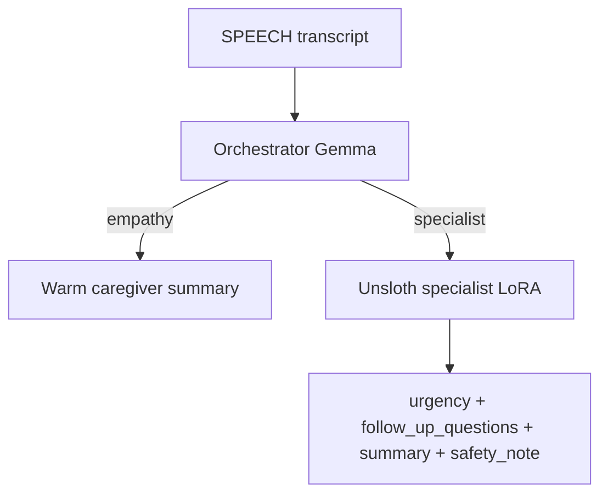

# Project progress

This file is the plain-English map of the repo. It is updated whenever the implementation changes.

---

## 1) What this project does

This project is an **elder-care monitoring system** split across three roles: sensors and AI on a Raspberry Pi at home, a **“phone core”** service that stores events in a searchable database and can run a small AI (Gemma) to summarise speech, and (planned) a **caregiver app** on a phone that reads status and history over the network. Right now the **phone core** and **shared contracts** are implemented so you can fake events from a laptop and query them like the real Pi and app would later.

---

## 2) Every important file (plain English + how it connects)

*Caches like `__pycache__`, `.mypy_cache`, and `.pytest_cache` are auto-created when you run Python, mypy, or pytest. They are not listed here; you can delete them anytime.*

### Root (top folder)

| File | What it does | How it connects |
|------|----------------|-----------------|
| **PROGRESS.md** | This document: explains the project, files, flow, status, and how to run. | Points readers to the rest of the repo. |
| **README.md** | Short “how to install and run” instructions for developers. | Same story as PROGRESS section 6, in a compact form. |
| **pyproject.toml** | Declares the Python package name, dependencies (FastAPI, database helpers, tests), and mypy/pytest settings. | Used by `pip install -e .` so all `phone/` code can import libraries. |
| **.gitignore** | Tells Git to ignore local databases, virtual envs, and cache folders. | Keeps noise out of version control. |
| **master-plan.md** | Full engineering blueprint: folder layout, APIs, who owns what file. | The team’s “source of truth” for design; `phone/` and `contracts/` follow it. |
| **tech-stack.md** | Chooses tools (Python, FastAPI, SQLCipher option, Kotlin app later, etc.). | Explains *why* libraries were picked; aligns with `pyproject.toml`. |
| **team-split (1).md** | Describes Person 1 (hardware), Person 2 (phone core), Person 3 (caregiver app) and deliverables. | Matches who built `phone/` vs what is still future work. |

### `contracts/` — shared agreements (everyone aligns here)

| File | What it does | How it connects |
|------|----------------|-----------------|
| **contracts/proto/event_envelope.proto** | Defines the **same logical “envelope”** everywhere: ID, time, type of event (speech, fall, etc.), and payloads. The team can send this on the wire as **either JSON or Protobuf** (team contract). **Protobuf** is usually smaller on the wire and **faster to parse** than JSON; **JSON** is easier to read in logs and test with `curl`. Today’s phone server accepts **JSON** on `POST /intake/event`; switching the Pi to send binary Protobuf would need a small intake change (decode bytes, then same validation). | `phone/intake/validator.py` checks the same fields as this `.proto`, no matter which encoding the Pi chooses later. |
| **contracts/proto/control_command.proto** | Defines commands *back* to the Pi (speak text, acknowledge emergency, etc.). | Same idea as the envelope: can be JSON (what `command_emitter` sends today) or Protobuf later if you standardise on binary for that hop too. |
| **contracts/db/schema.sql** | Defines SQLite tables: events, search index, medical rows, reminders, settings. | `phone/memory/db.py` runs this script when the database opens; `upsert.py` and `query/api.py` read/write these tables. |
| **contracts/http/intake_api.yaml** | OpenAPI description of “Pi → phone” HTTP endpoints (e.g. post an event). | Documents what `phone/intake/server.py` implements for Person 1. |
| **contracts/http/query_api.yaml** | OpenAPI description of “app → phone” read APIs (status, search, chat stream). | Documents what `phone/query/api.py` implements for Person 3. |
| **contracts/mock/sample_envelopes.json** | Example JSON events for demos and tests. | Can be used with the injector script; same shape as live Pi traffic. |
| **contracts/mock/inject_events.py** | Small script: sends fake events to your running phone server for development. | Talks to `POST /intake/event` on `phone/intake/server.py`. |

### `phone/` — Person 2 “phone core” service (Python)

| File | What it does | How it connects |
|------|----------------|-----------------|
| **phone/__init__.py** | Marks `phone` as a Python package; holds version string. | Imported by tests and tools. |
| **phone/config.py** | Reads environment variables (database path, Pi URL, AI model path, time skew). | Used everywhere paths or URLs are needed so tests can override without editing code. |
| **phone/main.py** | Starts the web server (uvicorn). Uses uvloop on Linux/Mac, default loop on Windows. | Entry point: `python -m phone.main` or uvicorn pointing at `phone.intake.server:app`. |
| **phone/intake/server.py** | Main web app: health check, receives events, saves to DB, sends commands to Pi. | Imports validator, deduper, router, upsert, query router, command emitter. |
| **phone/intake/validator.py** | Checks each incoming event: valid ID, time not too far off, payload matches event type. | Called first on every `POST /intake/event`; rejects bad data before the DB. |
| **phone/intake/deduper.py** | Remembers seen event IDs (bloom filter + database) so duplicates are rejected. | Called from `server.py` before writing; stops double-counting if the Pi retries. |
| **phone/intake/__init__.py** | Package marker for the intake folder. | — |
| **phone/gemma/client.py** | Loads the Gemma AI model if a model file path is set; otherwise returns empty so stubs run. | Used by classifier, summarizer, and chat when you want real AI. |
| **phone/gemma/router.py** | Decides what to do per event type: e.g. speech → summarise + maybe medical row; emergency → mark alert + “speak” command. | Called from `intake/server.py` after validation; results drive `upsert.py` and `command_emitter.py`. |
| **phone/gemma/orchestrator.py** | **Empathetic orchestrator** — routes SPEECH to warm conversation vs specialist triage (Gemma when loaded; keyword fallback via `speech_routing.py`). | First step for every SPEECH event in `router.py`. |
| **phone/gemma/specialist.py** | **Unsloth specialist** — triage JSON: urgency, follow-up questions, caregiver summary, safety note (LoRA GGUF when `PHONE_GEMMA_SPECIALIST_MODEL` set). | Used when orchestrator chooses `specialist`. |
| **phone/gemma/speech_routing.py** | Keyword fallback when orchestrator model is not loaded. | Used by `orchestrator.decide_route`. |
| **phone/gemma/empathy.py** | Template caregiver one-liners when orchestrator model is not loaded. | Used by `orchestrator.empathy_summary`. |
| **phone/gemma/classifier.py** | Entity extraction for **OBJECT** events (legacy schema). | Used for OBJECT path in `router.py`. |
| **phone/gemma/summarizer.py** | Asks the AI (or a short text fallback) to write a one-line caregiver summary. | Used for SPEECH inside `router.py`. |
| **phone/gemma/__init__.py** | Package marker for Gemma-related code. | — |
| **phone/memory/db.py** | Opens the SQLite file, applies `schema.sql`, manages one-writer locks and commits. | Used by `server.py`, `query/api.py`, and tests via `get_db()`. |
| **phone/memory/upsert.py** | Inserts or updates rows in `events`, search index, `medical`, `reminders`, and settings. | Only intake path should write events; query mostly reads. |
| **phone/memory/fts.py** | Runs full-text search over stored transcripts and summaries. | Used by `query/api.py` search and chat context. |
| **phone/memory/__init__.py** | Package marker for memory/DB code. | — |
| **phone/actions/command_emitter.py** | HTTP client that POSTs a command to the Pi’s URL (speak, ack emergency, etc.). | Called after saving emergency-related events or when caregiver acknowledges. |
| **phone/actions/__init__.py** | Package marker for outbound actions. | — |
| **phone/query/api.py** | Read APIs for the future app: status, event list, search, medical list, ack emergency, streaming “chat” over memories. | Mounted on the same FastAPI app as intake in `server.py`. |
| **phone/query/__init__.py** | Package marker for query routes. | — |
| **phone/scripts/mock_rpi.py** | Fake Pi: tiny web server that logs any command the phone sends. | Run while developing so `command_emitter` has something to talk to. |
| **phone/scripts/__init__.py** | Makes `phone.scripts` importable as a package. | Lets you run `python -m phone.scripts.mock_rpi`. |

### `phone/tests/` — automated checks

| File | What it does | How it connects |
|------|----------------|-----------------|
| **phone/tests/conftest.py** | Sets a temporary database and test client for each test. | All tests use this so they do not touch your real `data/phone.db`. |
| **phone/tests/test_intake.py** | Tests: health, save speech + search, duplicate rejection, emergency command, ack emergency. | Hits `server.py` end-to-end. |
| **phone/tests/test_memory.py** | Tests listing events after saving a system event. | Uses query + intake together. |
| **phone/tests/test_gemma.py** | Tests that the chat endpoint returns a streaming response. | Uses `/query/chat` after a simple intake. |
| **phone/tests/test_speech_routing.py** | Unit tests for specialist gate + empathy summary; HTTP checks `triage_route` empathy vs specialist on intake. | Covers `speech_routing.py`, `empathy.py`, and `router.py` SPEECH branch. |

### `.github/workflows/`

| File | What it does | How it connects |
|------|----------------|-----------------|
| **ci-phone.yml** | On GitHub, installs the project and runs pytest (and mypy) when phone/contracts code changes. | Guards regressions on `phone/` and `contracts/`. |

---

## 3) Full data flow (Pi detection → caregiver sees it)

**Today:** parts of this use a **mock Pi** and a **mock injector** until real hardware is wired.

1. **Sensors on the home device (Raspberry Pi — Person 1, not fully in this repo yet)** notice something: speech transcribed, motion, button press, etc.
2. The Pi builds an **event envelope** (ID, time, type, details) and **POSTs it over the home network** to the phone core at something like `http://<phone-or-home-server>:8000/intake/event` — today as **JSON**; the team contract also allows **Protobuf** on the wire for smaller/faster payloads once intake decodes it.
3. **Phone core** (`server.py`) receives the body, **validates** it (`validator.py`), checks it is not a **duplicate** (`deduper.py`).
4. **Router** (`router.py` + Gemma helpers) decides enrichment. For **SPEECH**, a **two-model design**: (1) **orchestrator** — empathetic routing for greetings, loneliness, routine chat; (2) **specialist** (Unsloth LoRA) — structured triage JSON with urgency, safe follow-up questions, caregiver summary, and safety note when symptoms or meds need clinical follow-up. Fall/emergency still mark “active emergency” and queue **speak** for the Pi.
5. **Database** (`db.py` + `upsert.py`) saves the event and updates the **search index** (`fts.py`) so text is findable later.
6. **Command emitter** (`command_emitter.py`) may **POST back** to the Pi (e.g. “play this phrase on the speaker”). During dev, **mock_rpi.py** receives that instead of a real Pi.
7. **Caregiver phone app (Person 3 — not built in this repo yet)** will periodically call **query** endpoints on the same phone core: status (“is there an emergency?”), lists, **search**, medical timeline, and optional **chat** over saved memories (`query/api.py`).
8. The caregiver **sees** alerts and history in the app UI — that UI is the missing piece; the **data and APIs** it will need are already defined in `query_api.yaml` and implemented in `query/api.py`.

---

## 4) What’s working right now

- Running the **phone core** as a web service (health + intake + query on one app).
- **Saving** validated events to SQLite with **full-text search**.
- **Stub AI path** without a heavy model file (summaries and classification use simple rules when no Gemma path is set).
- **Optional real Gemma** if you install the extra package and set `PHONE_GEMMA_MODEL` to a GGUF file.
- **Duplicate event protection** and **emergency / ack** flows at the HTTP + DB level.
- **Mock Pi listener** and **inject script** for local demos.
- **SPEECH routing:** orchestrator + specialist paths wired in code (see §8); stubs when no GGUF is set.

## 5) What’s not built yet

- **Unsloth LoRA training + GGUF export** for the specialist model (hackathon / Unsloth prize).
- **Separate orchestrator GGUF** (optional; can share base Gemma until a dedicated empathy-tuned weights file exists).
- **Person 1:** ESP32 firmware, Pi audio/vision pipelines, real `EventEnvelope` emitter hitting this service from hardware.
- **Person 3:** Kotlin/Android caregiver app (screens, pairing, notifications) calling the query API.
- **Production hardening:** auth between app and phone core, TLS on LAN, optional **SQLCipher** install path for encrypted DB in deployment.
- **Single packaged “phone” binary or Docker image** as an optional convenience (you can still run with uvicorn today).

---

## 6) How to run it locally (exact commands)

Open a terminal in the project folder (`dementia`), then:

```text
pip install -e ".[dev]"
```

Start the phone core (API on port 8000):

```text
uvicorn phone.intake.server:app --host 127.0.0.1 --port 8000
```

In a **second** terminal, start the fake Pi (listens on port 8080):

```text
python -m phone.scripts.mock_rpi
```

In a **third** terminal, send fake speech events to the phone core:

```text
python contracts/mock/inject_events.py --target http://127.0.0.1:8000 --count 3 --type SPEECH
```

Run automated tests:

```text
pytest phone/tests -q
```

(Optional) typecheck:

```text
mypy phone
```

**Note:** On Windows, use `python` / `py -3` depending on how Python is installed; the commands above assume `python` runs Python 3.11+.

**Interactive API (optional):** With the phone core running, open a browser at **http://127.0.0.1:8000/docs** — FastAPI shows every route; you can click “Try it out” on `GET /health`, `POST /intake/event`, `GET /query/search`, etc.

---

## 7) What to expect, what to test, and how to test

### What you should see when it’s working

- **Terminal 1 (uvicorn):** Lines like `Uvicorn running on http://127.0.0.1:8000` and a log entry each time something hits the API.
- **Terminal 2 (mock Pi):** When you inject an **EMERGENCY** or **FALL** event (or acknowledge an emergency), you should see **log lines** showing a JSON **command** (e.g. `SPEAK`) — that proves the phone tried to talk to the Pi. If mock Pi is **not** running, the phone still **saves** the event; the command step just **fails quietly** in the background (no crash).
- **Terminal 3 (inject script):** For each fake event, `200` and a short JSON body like `{"stored":true,"event_id":"..."}`. If you send the **same** event twice, the second time should be **`409`** with `duplicate: true` (by design).
- **First run:** A folder **`data/`** may appear with **`phone.db`** — that is your local SQLite database (events + search index).

### Quick manual checks (good for a demo)

Do these **while Terminal 1 is running**. You can use the **Swagger UI** (`/docs`) or paste into a browser / use `curl` where noted.

| Step | What to do | What “good” looks like |
|------|------------|-------------------------|
| 1 | Open **http://127.0.0.1:8000/health** | JSON: `{"status":"ok"}` |
| 2 | `GET http://127.0.0.1:8000/query/status` | JSON with `last_event_ts`, `active_emergency`, `fsm_state` (values change after you inject events). |
| 3 | Inject **SPEECH** (inject script or `/docs` → `POST /intake/event`) | `200` + `stored: true`. Then `GET /query/search?q=aspirin` (or a word from your transcript) — you should get **at least one hit** with a snippet or summary. |
| 4 | Inject **EMERGENCY** with mock Pi **running** | Mock Pi terminal shows a **ControlCommand** with type **SPEAK**. `GET /query/status` → **`active_emergency`: true**. |
| 5 | `POST /query/ack-emergency` with body `{"event_id":"any-uuid","note":"cleared"}` | `200`; then **`active_emergency`: false** on status. Mock Pi may show **ACK_EMERGENCY**. |
| 6 | `GET /query/chat?q=tea` (after injecting speech that mentions “tea”) | Response is **`text/event-stream`** (SSE): many `data: ...` lines in the raw response. |

### Automated tests (regression)

From the project folder:

```text
pytest phone/tests -q
```

**What they cover:** health endpoint; save speech + FTS search; duplicate rejection; emergency path issues a command; ack clears emergency flag; listing events; chat stream returns SSE. **All seven should pass** after `pip install -e ".[dev]"`.

### Things that often go wrong

| Problem | What to check |
|---------|----------------|
| **Address already in use** | Something else is on port **8000** or **8080**. Stop that process or change the port in the uvicorn / mock_rpi command. |
| **422 on intake** | Event `ts` must be roughly **“now”** (within a few minutes). The inject script uses current time; old JSON fixtures need their `ts` updated. |
| **Search returns nothing** | Use a word that actually appears in the **transcript** or **summary** you stored; very short or stop-word-only queries may rank oddly. |
| **No Gemma / “no model” in chat** | Normal if **`PHONE_GEMMA_MODEL`** is unset — chat still streams a short fallback message. For a real model, install **`pip install -e ".[gemma]"`**, set the env var to a valid **GGUF** path, restart uvicorn. |

---

## 8) SPEECH routing — two-tier models (implemented)



| Tier | Module | Role |
|------|--------|------|
| **Orchestrator** | `orchestrator.py` | Empathetic “front door”: route to conversation vs triage. Env: `PHONE_GEMMA_ORCHESTRATOR_MODEL`. |
| **Specialist** | `specialist.py` | Unsloth target: fixed JSON for question-style / symptom situations. Env: `PHONE_GEMMA_SPECIALIST_MODEL`. |

**Specialist JSON (train & infer):**

```json
{
  "urgency": "none|low|medium|high|critical",
  "follow_up_questions": ["...", "..."],
  "caregiver_summary": "one factual line",
  "safety_note": "no diagnosis, no dosing; escalate when severe"
}
```

**Tests:** [`phone/tests/test_speech_routing.py`](phone/tests/test_speech_routing.py).

**Next (Unsloth):** fine-tune Gemma with LoRA on `(transcript → specialist JSON)` pairs; export GGUF; set `PHONE_GEMMA_SPECIALIST_MODEL`. Optionally fine-tune a separate orchestrator for routing + warmer empathy lines.
