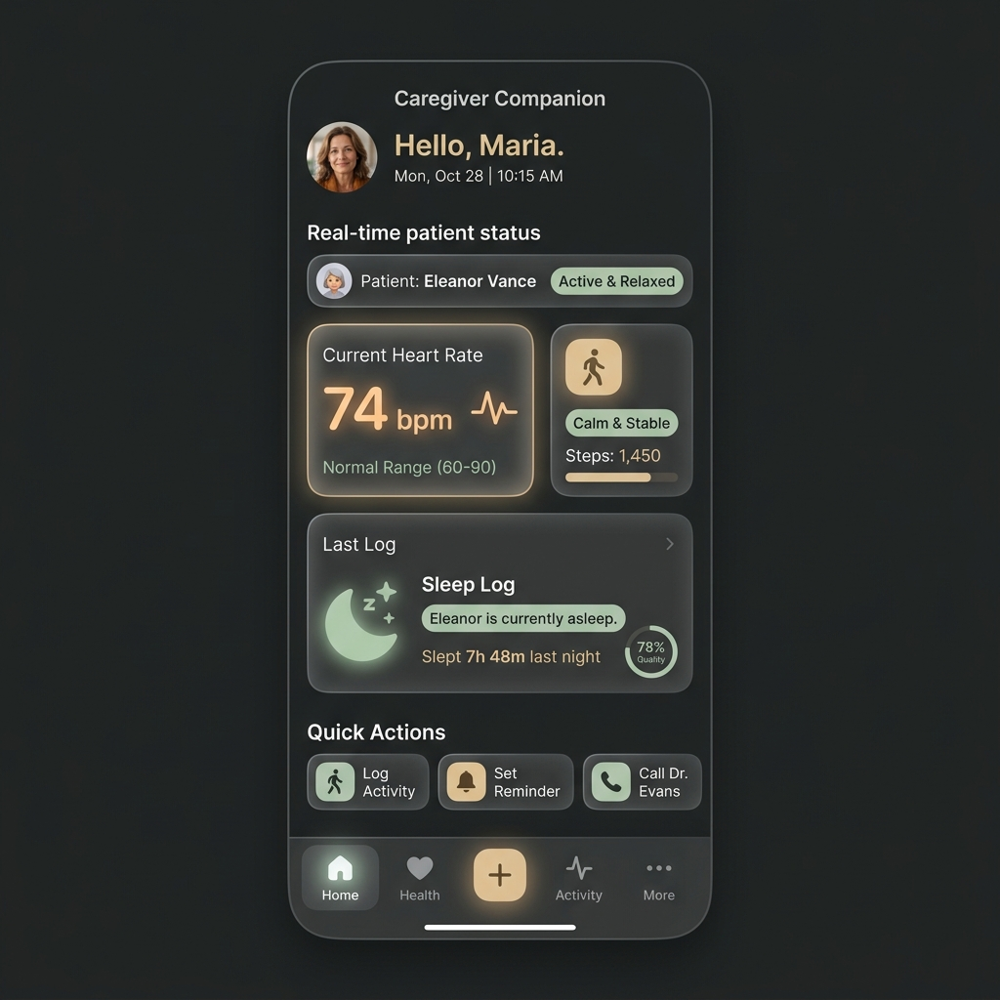
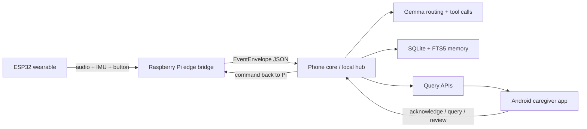

# Dementor

> An offline-first dementia-care companion that turns speech, movement, emergency signals, and camera snapshots into grounded caregiver support.

<p align="center">
  
</p>

<p align="center">
  <a href="#demo">Demo</a> •
  <a href="#why-dementor">Why Dementor</a> •
  <a href="#how-it-works">How It Works</a> •
  <a href="#system-architecture">Architecture</a> •
  <a href="#quickstart">Quickstart</a> •
  <a href="#repository-guide">Repository Guide</a>
</p>

---

## Demo

### Product Walkthrough

`[PLACEHOLDER: add YouTube or Loom demo link here]`

Example:

```md
[](https://your-demo-link)
```

### Screenshots

Add these before sharing publicly:

- `[PLACEHOLDER]` wearable / neckband prototype photo
- `[PLACEHOLDER]` Raspberry Pi + ESP32 hardware setup
- `[PLACEHOLDER]` caregiver app timeline screen
- `[PLACEHOLDER]` caregiver memory assistant screen
- `[PLACEHOLDER]` emergency acknowledgement flow

---

## Why Dementor

Dementor was built around one practical caregiving problem:

When someone living with dementia seems disoriented, how does a caregiver know whether this is a passing moment of confusion or something that needs attention right now?

Most solutions are app-first, fragmented across devices, or too dependent on cloud workflows to feel reliable in real-world caregiving moments.

Dementor takes a different approach:

- **Offline-first by design** for privacy, resilience, and low-latency response
- **Grounded assistance, not free-form AI** so the system stays useful and bounded
- **Caregiver-facing summaries and alerts** instead of raw sensor noise
- **Structured memory support** for questions like where an important object was last seen

This is a caregiver-support prototype, **not** a diagnostic medical device.

---

## What It Does

Dementor combines a wearable sensing layer, a Raspberry Pi edge bridge, a local phone-core hub, and an Android caregiver app.

### Current prototype capabilities

| Capability | What happens |
|---|---|
| Emergency escalation | Button presses and emergency events appear in the caregiver timeline and can be acknowledged from the app |
| Fall-related detection | IMU/button signals are routed as structured safety events |
| Speech capture | Audio chunks are sent through the phone-side Gemma pipeline for transcription, routing, and summary generation |
| Visual memory | Camera snapshots become searchable image events with scene/object summaries |
| Memory retrieval | SQLite + FTS5 index prior events, summaries, and durable context for caregiver queries |
| Caregiver chat | The app can ask memory questions over retrieved local evidence |
| Durable context | Gemma can append grounded facts such as people, places, routines, and object locations |

### What it intentionally does not do

- pretend to be a doctor
- diagnose dementia
- prescribe medication
- rely on continuous cloud surveillance
- store continuous video history by default

---

## How It Works



### End-to-end flow

1. The wearable and edge layer capture audio, motion, button, and image signals.
2. The Raspberry Pi normalizes them into structured `EventEnvelope` events.
3. The phone core validates, dedupes, stores, and routes each event.
4. Gemma generates bounded summaries, classifications, and memory updates.
5. The caregiver app reads live status, event timeline, and memory-chat responses.
6. Emergency acknowledgements can flow back from the app to the Pi command server.

---

## System Architecture

### Runtime surfaces

#### 1. ESP32 wearable / sensor node

- microphone stream over Wi-Fi
- IMU sampling
- emergency button events

#### 2. Raspberry Pi edge bridge

- receives wearable signals
- captures camera snapshots
- emits structured events to the hub
- executes command callbacks such as spoken acknowledgements

#### 3. Phone core / local hub

- FastAPI intake and query APIs
- event validation and deduplication
- SQLite persistence
- FTS5 search
- Gemma routing, multimodal analysis, summaries, and tool calls

#### 4. Android caregiver app

- timeline of recent events
- emergency state and acknowledgement
- memory assistant chat
- medical/dashboard style views for context

### Canonical event types

- `AUDIO`
- `SPEECH`
- `FALL`
- `EMERGENCY`
- `IMAGE`
- `OBJECT`
- `REMINDER`
- `VITALS`
- `SYSTEM`

### Safety stance

Safety logic must stay outside the model.

Dementor is designed to:

- preserve context
- surface possible emergencies
- summarize caregiver-relevant memory signals

It is not designed to:

- make clinical decisions
- claim medication compliance without confirmation
- replace a trained medical professional

---

## Quickstart

### Prerequisites

- Python 3.11+
- [`uv`](https://docs.astral.sh/uv/)
- Android Studio for the caregiver app
- Raspberry Pi + ESP32 for the full hardware path

### 1. Start the phone core

```bash
cd dementia
uv pip install -e ".[dev]"
uv run uvicorn phone.intake.server:app --host 0.0.0.0 --port 8000
```

Health check:

```powershell
Invoke-RestMethod http://127.0.0.1:8000/health
```

### 2. Run a mock pipeline

This is the fastest way to see the core working without hardware.

```bash
uv run python -m phone.scripts.mock_rpi
```

Inject sample events:

```bash
uv run python contracts/mock/inject_events.py --target http://127.0.0.1:8000 --count 5 --type SPEECH
```

### 3. Run the caregiver app

Open the Android project in:

```text
sementia/caregiver-app
```

Use:

- `10.0.2.2` when the app runs in an Android emulator
- your local LAN IP when the app runs on a physical phone

### 4. Run the real device flow

For the complete Raspberry Pi + ESP32 + camera + Android loop, follow:

- [`docs/DEMO.md`](./docs/DEMO.md)

---

## Core Demo Loops

### 1. Emergency loop

1. ESP32 button or emergency signal is emitted.
2. The Pi sends an `EMERGENCY` event to the hub.
3. The caregiver app shows a high-priority timeline card.
4. The caregiver acknowledges it.
5. The Pi command receiver gets the acknowledgement and can speak it back.

### 2. Speech memory loop

1. The Pi sends audio chunks as `AUDIO` events.
2. The phone-side Gemma path transcribes and routes them.
3. The system stores a concise caregiver-facing summary.
4. The app can later retrieve that context through chat and timeline views.

### 3. Visual memory loop

1. The Pi captures a JPEG keyframe.
2. The hub routes it through the image-analysis path.
3. The event is stored with a scene/object summary.
4. The caregiver app can view and query that memory later.

---

## Repository Guide

### Main directories

| Path | Purpose |
|---|---|
| `phone/` | FastAPI phone-core hub: intake, validation, query APIs, memory, Gemma routing |
| `hardware/Production/` | Current Raspberry Pi and ESP32 production demo path |
| `sementia/caregiver-app/` | Current Android caregiver app |
| `contracts/` | Shared event, API, and database contracts |
| `training/` | Kaggle and model-training assets for specialist routing work |
| `docs/` | Demo guide, architecture, and Gemma tool-call docs |
| `dementor-landing/` | Landing page and visual assets used for presentation |

### Most useful docs

- [`docs/DEMO.md`](./docs/DEMO.md): full end-to-end walkthrough
- [`docs/ARCHITECTURE.md`](./docs/ARCHITECTURE.md): canonical runtime and event model
- [`docs/GEMMA_TOOLS.md`](./docs/GEMMA_TOOLS.md): tool-call boundaries and model behavior

---

## Configuration

### Phone core environment variables

| Variable | Meaning |
|---|---|
| `PHONE_DB_PATH` | SQLite database path, default `./data/phone.db` |
| `PHONE_CONTEXT_PATH` | Durable JSONL context path, default `./data/context.jsonl` |
| `PHONE_DB_KEY` | SQLCipher key when encryption is enabled |
| `PHONE_USE_SQLCIPHER` | Set `1` or `true` to use SQLCipher |
| `PHONE_RPI_BASE` | Raspberry Pi command URL, for example `http://<pi-ip>:8010` |
| `PHONE_GEMMA_MODEL` | Local Gemma GGUF path; empty uses deterministic fallback |
| `PHONE_GEMMA_ORCHESTRATOR_MODEL` | Optional orchestrator model override |
| `PHONE_GEMMA_SPECIALIST_MODEL` | Optional specialist model override |
| `PHONE_CLOCK_SKEW_MS` | Max timestamp skew for incoming events |

---

## Testing

### Phone core

```bash
uv run pytest phone/tests -q
```

### Android caregiver app

```powershell
cd sementia/caregiver-app
.\gradlew.bat testDebugUnitTest
```

---

## Visual Assets Checklist

Before linking this repo publicly, add:

- `docs/assets/readme/demo-cover.png`
- `docs/assets/readme/hardware-overview.jpg`
- `docs/assets/readme/wearable-closeup.jpg`
- `docs/assets/readme/timeline-screen.png`
- `docs/assets/readme/chat-screen.png`
- `docs/assets/readme/architecture-diagram.png`

Recommended order on the page:

1. hero product image
2. 30 to 60 second demo thumbnail
3. hardware photo
4. caregiver app screenshots
5. architecture diagram

---

## Project Status

This repository represents a **working prototype** built during an early build sprint.

What is already real:

- event ingestion
- local persistence
- caregiver timeline
- emergency acknowledgement flow
- speech and image routing through the phone-side Gemma pipeline

What is still evolving:

- hardware polish
- model tuning and evaluation
- app UX refinement
- deployment hardening

---

## Safety Note

Dementor is a caregiver-support system prototype. It can preserve context, summarize signals, and surface potential emergencies, but it is **not** a diagnostic, monitoring, or treatment device approved for clinical use.

---

## Acknowledgements

Built as part of `#10Products10Weeks`, combining embedded systems, local AI, multimodal memory, and caregiver-first product design.
