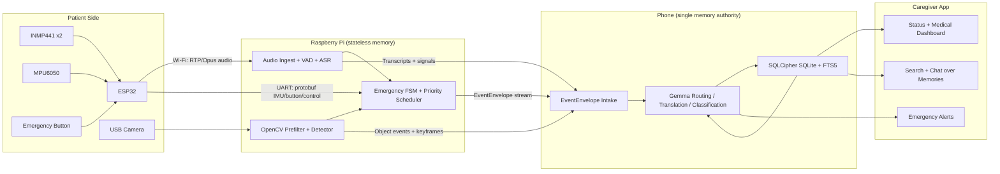

# 01 - Overall System Architecture

```mermaid
flowchart LR
  subgraph Patient_Side["Patient Side"]
    MIC["INMP441 x2"]
    IMU["MPU6050"]
    BTN["Emergency Button"]
    ESP["ESP32"]
    CAM["USB Camera"]
    MIC --> ESP
    IMU --> ESP
    BTN --> ESP
  end

  subgraph RPi["Raspberry Pi (stateless memory)"]
    ING["Audio Ingest + VAD + ASR"]
    VSN["OpenCV Prefilter + Detector"]
    FSM["Emergency FSM + Priority Scheduler"]
    
    ING --> FSM
    VSN --> FSM
    
  end

  subgraph Phone["Phone (single memory authority)"]
    EVT["EventEnvelope Intake"]
    GEM["Gemma Routing / Translation / Classification"]
    DB["SQLCipher SQLite + FTS5"]
    EVT --> GEM
    GEM --> DB
    DB --> GEM
  end

  subgraph Caregiver["Caregiver App"]
    DASH["Status + Medical Dashboard"]
    CHAT["Search + Chat over Memories"]
    ALERT["Emergency Alerts"]
  end

  ESP -- "Wi-Fi: RTP/Opus audio" --> ING
  ESP -- "UART: protobuf IMU/button/control" --> FSM
  CAM --> VSN
  FSM -- "EventEnvelope stream" --> EVT
  VSN -- "Object events + keyframes" --> EVT
  ING -- "Transcripts + signals" --> EVT

  DB --> DASH
  DB --> CHAT
  GEM --> ALERT
```

