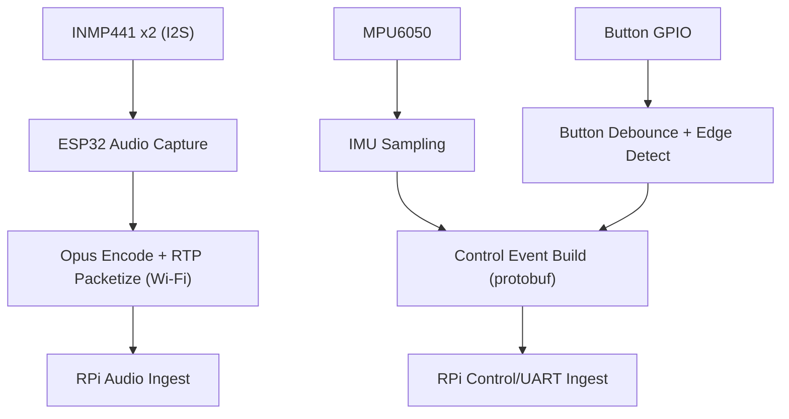

# 02 - ESP32 Ingestion Module

```mermaid
flowchart TD
  A["INMP441 x2 (I2S)"] --> B["ESP32 Audio Capture"]
  C["MPU6050"] --> D["IMU Sampling"]
  E["Button GPIO"] --> F["Button Debounce + Edge Detect"]

  B --> G["Opus Encode + RTP Packetize (Wi-Fi)"]
  D --> H["Control Event Build (protobuf)"]
  F --> H

  G --> I["RPi Audio Ingest"]
  H --> J["RPi Control/UART Ingest"]

  
 
```

