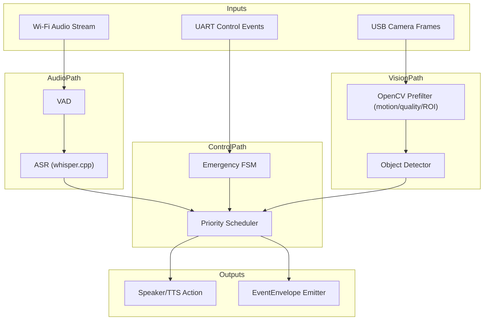

# 03 - RPi Edge Runtime Module (Stateless Memory)

```mermaid
flowchart TD
  subgraph Inputs
    A["Wi-Fi Audio Stream"]
    B["UART Control Events"]
    C["USB Camera Frames"]
  end

  subgraph AudioPath
    D["VAD"]
    E["ASR (whisper.cpp)"]
  end

  subgraph VisionPath
    F["OpenCV Prefilter (motion/quality/ROI)"]
    G["Object Detector"]
  end

  subgraph ControlPath
    H["Emergency FSM"]
    I["Priority Scheduler "]
  end

  subgraph Outputs
    J["Speaker/TTS Action"]
    K["EventEnvelope Emitter"]
  end

  A --> D --> E --> I
  B --> H --> I
  C --> F --> G --> I
  I --> J
  I --> K
```

