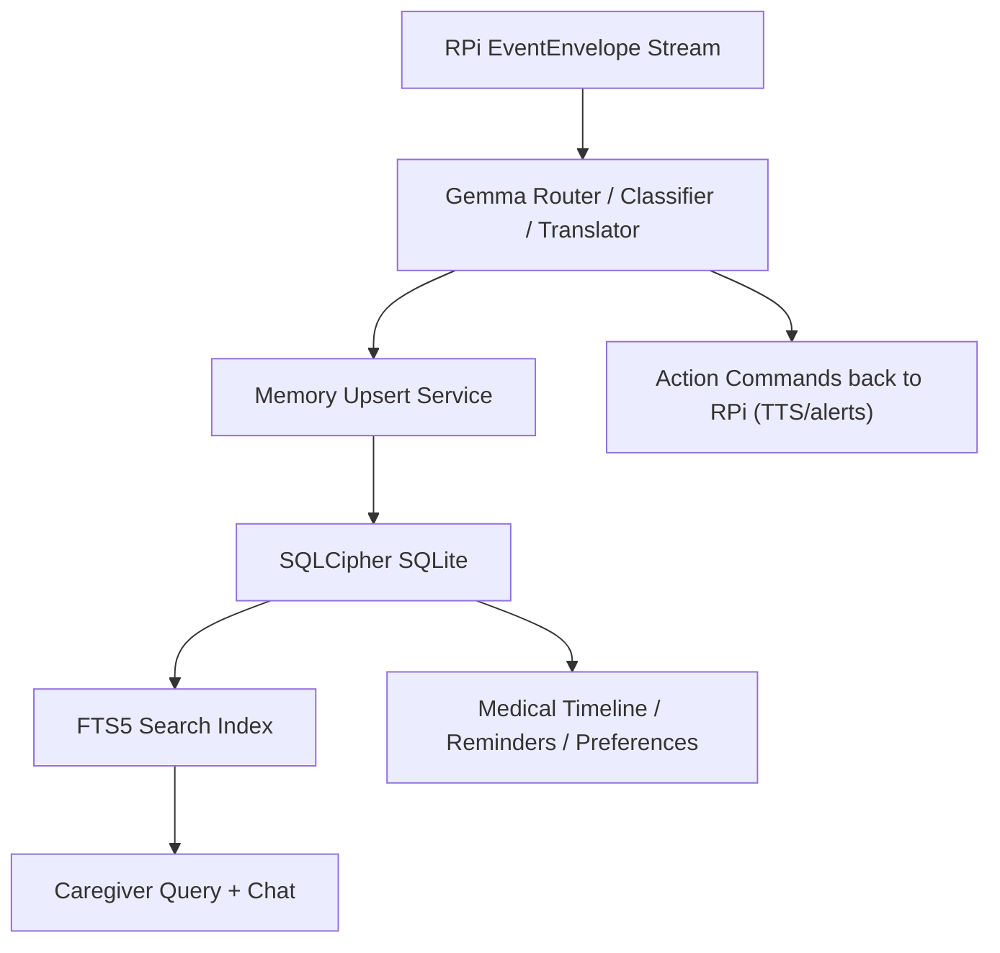

# 04 - Phone Module: Memory + Gemma (Single Writer)

```mermaid
flowchart TD
  A["RPi EventEnvelope Stream"]
  A --> C["Gemma Router / Classifier / Translator"]
  C --> D["Memory Upsert Service"]
  D --> E["SQLCipher SQLite"]
  E --> F["FTS5 Search Index"]
  F --> G["Caregiver Query + Chat"]
  E --> H["Medical Timeline / Reminders / Preferences"]
  C --> I["Action Commands back to RPi (TTS/alerts)"]

 
  
```

