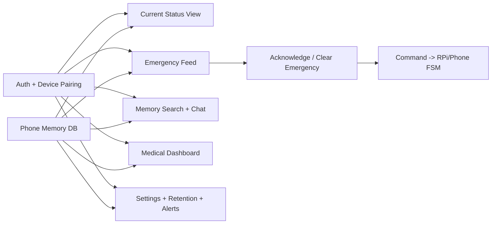

# 05 - Caregiver App Module

```mermaid
flowchart LR
  A["Auth + Device Pairing"] --> B["Current Status View"]
  A --> C["Emergency Feed"]
  A --> D["Memory Search + Chat"]
  A --> E["Medical Dashboard"]
  A --> F["Settings + Retention + Alerts"]

  G["Phone Memory DB"] --> B
  G --> C
  G --> D
  G --> E
  G --> F

  C --> H["Acknowledge / Clear Emergency"]
  H --> I["Command -> RPi/Phone FSM"]
```

