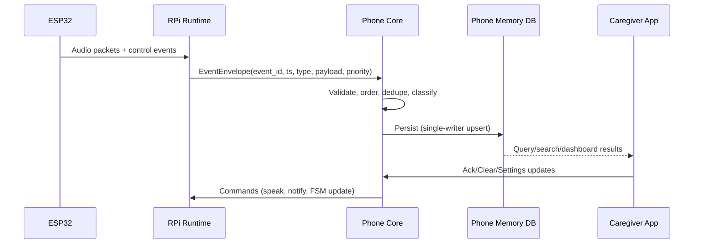

# 06 - Event Contract + Storage Ownership

## EventEnvelope Lifecycle



## Storage Ownership Model

```mermaid
flowchart TD
  A["ESP32"] -->|No persistent memory| B["RPi"]
  B -->|No persistent memory (RAM only)| C["Phone"]
  C -->|ALL persistent memory writes| D["Encrypted SQLite + FTS5"]
```

